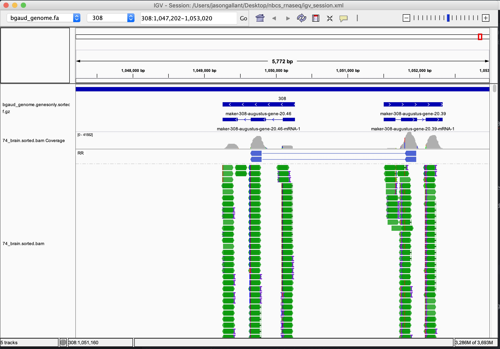
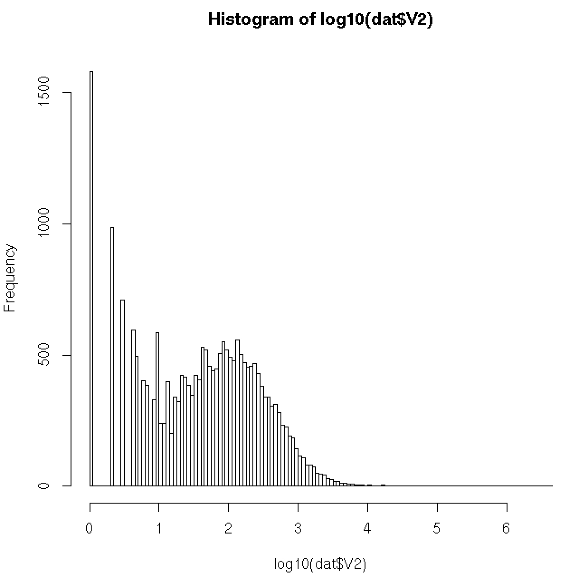

# Read Alignment
We're going to switch gears now and begin to think about how we quantify expression for RNA-seq experiments.  

Recall from my introductory lecture that the reads we obtain are directly proportional to the abundance of of the mRNA in the sample.  When we did denovo assembly, we treated this as redundant information, and performed normalization to remove this information.  Now that we have a reference that contains the sequences, we will take these reads and align them to our transcriptome.  Once they are aligned, we can simply count the reads to determine the relative expression levels of each gene.

For this species, we fortunately have a genome available.  So that we can more easily compare the performance of Illumina and Oxford Nanopore data, we will be performing our alignments and read counting based on the genome, not the de-novo transcriptome we assembled.

## Performing Alignments with Bowtie2

Let's log back into the HPCC

```bash
ssh user@hpcc
```

The first step is to perform the alignment-- let's take a look at the script that performs this step:

```bash
## submit_align.sb

#!/bin/bash --login
########## Define Resources Needed with SBATCH Lines ##########

#SBATCH --time=04:00:00             # limit of wall clock time - how long the job will run (same as -t)
#SBATCH --ntasks=1                  # number of tasks - how many tasks (nodes) that you require (same as -n)
#SBATCH --cpus-per-task=16           # number of CPUs (or cores) per task (same as -c)
#SBATCH --mem=12G                    # memory required per node - amount of memory (in bytes)
#SBATCH --job-name align_brain_74      # you can give your job a name for easier identification (same as -J)

########## Command Lines to Run ##########

module load bowtie2
module load samtools

cd ${SLURM_SUBMIT_DIR}

bowtie2 -p 16  -x bgaud -1 74_brain_S26_L002_R1_001.fastq.gz.PwU.qtrim.fq -2 74_brain_S26_L002_R2_001.fastq.gz.PwU.qtrim.fq | samtools view -bS - > 74_brain.bam
samtools sort 74_brain.bam > 74_brain.sorted.bam
samtools index 74_brain.sorted.bam
```

## Using IGV to Examine Alignments
Let's look at the alignments that we created in a slightly more graphical way than we have been.

1. Go to http://software.broadinstitute.org/software/igv/download to obtain the software, and install
2. Download (igv_session.xml)[igv_session.xml] to your local computer
3. Open IGV and load `igv_session.xml`

You should see a dataset that looks like this:



**Questions**
1. What are the blue bars at the top of the window representing?
2. What are the green bars representing?
3. What do the blue bars with lines connecting them represent?
4. Hover over the mRNA sequence with your mouse.  What gene is this that we are looking at?
5.  Do you think the gene is highly or lowly expressed?

## Counting Reads with HTSeq
Next, we run an algorithm called HTSeq, which counts the reads algorithmically that overlap genes in the genome.  This is a basic method of quantifying expression, but is central to the premise of RNAseq.  Dr. Hoke will discuss more advanced concepts in RNA-seq later this week.

Let's go back to our terminal and check out the HTseq script:

```bash
#!/bin/bash --login
########## Define Resources Needed with SBATCH Lines ##########

#SBATCH --time=04:00:00             # limit of wall clock time - how long the job will run (same as -t)
#SBATCH --ntasks=1                  # number of tasks - how many tasks (nodes) that you require (same as -n)
#SBATCH --cpus-per-task=2           # number of CPUs (or cores) per task (same as -c)
#SBATCH --mem=12G                    # memory required per node - amount of memory (in bytes)
#SBATCH --job-name htseq_brain74      # you can give your job a name for easier identification (same as -J)

########## Command Lines to Run ##########
cd ${SLURM_SUBMIT_DIR}
source htseq/bin/activate
htseq-count -s no -r pos -t gene -i ID -f bam 74_brain.sorted.bam bgaud_genome.genesonly.gff > brain74.counts
```

Now that we've obtained the count data, we need to have a look at it.  We're going to start up R and have a quick look at "genome wide" expression:
```bash
module purge
module load GCC/7.3.0-2.30  OpenMPI/3.1.1
module load R/3.5.1-X11-20180604
R
```

Now that R is started, you should see the `>` prompt.  Run the following code:

```R
require(data.table)
dat<-fread('./bgaud_counts_and_gene_info.txt')
dat<-dat[order(-Counts),]
hist(log10(dat$Counts), 100)
head(dat)
```
The data will look like this: 

**Questions**
1.  Are the majority of genes expressed in this sample of B. gauderio brain?
2.  What is the average number of reads per gene in our sample?
3.  What is the maximum number of reads per gene that we observe?
4.  Can you think of some reasons why the number of reads would be inaccurate for determining expression levels?


## Normalizing Read counts
Two factors that will influence your counts are how *deeply* you sampled your transcriptome (coverage) and how long each transcript is.  If you just compare raw counts, particularly across experiments or between transcripts that are very different in terms of their length, you'll have a poor idea of expression.

One way of normalizing is using a metric called TPM or Transcripts Per Kilobase Million.  Here’s how you calculate TPM:
1. Divide the read counts by the length of each gene in kilobases. This gives you reads per kilobase (RPK).
2. Count up all the RPK values in a sample and divide this number by 1,000,000. This is your “per million” scaling factor.
3. Divide the RPK values by the “per million” scaling factor.

Let's do this in R:

```R
library(data.table)
new_fdata<-fread('./bgaud_counts_and_gene_info.txt')

new_fdata$RPK<-new_fdata$Counts/(new_fdata$exon.lengths/1000)
scale<-sum(new_fdata$RPK)/1000000
new_fdata$TPM<-new_fdata$RPK/scale

new_fdata<-new_fdata[order(-TPM),]

head(new_fdata)

hist(log10(new_fdata$TPM), 100)
```

**Questions**
1. What is the most expressed gene in the B. gauderio brain according to this data?
2. Did this change compared to the raw counts?  Why?
