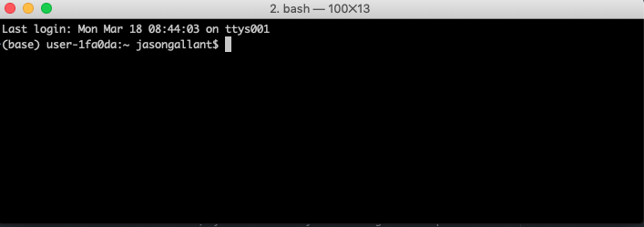

# Computing

### Computing Resources

Bioinformatics is the use of computing to analyze biological data.  This can be done on your own personal computer, or using a computing environment.  Given the large amount of data generated by sequencing technologies, personal computers are usually insufficient for analyzing sequencing data.  Instead, biologists use computing environments called 'clusters', which have large amounts of shared RAM and hard disk space.  There are several schemes clusters can devote many computers `(CPUs)` to work on a particular computational task.  These are typically referred to as *high performance computing* (HPC) environments.

To get a sense of the resources we are talking about, [this link](https://wiki.hpcc.msu.edu/pages/viewpage.action?pageId=20120131) lists the resources available on Michigan State University's High Performance Computing System.

HPCs are expensive to run and maintain.  HPCs and are typically run by universities, foundations, governments, or large corporations.  To perform your own analyses, you'll have to plan for access to some sort of high-performance computing environment.  Depending on where you are working, this may be freely available, but may incur costs.

What if there is no computing infrastructure where you are?  Amazon, Google and Microsoft all have cloud computing products available.  The pricing model is quite different: rather than the outright purchase of hardware (which can be millions of dollars), computers can be leased 'on demand', and you pay for data transfer and storage.  If you have the IT skills, this can be a way of getting exactly the computer you need for the task at hand, for exactly as long as you need it.  Rather than pay for the computer, you simply pay for the time that you use the computer for.  This is beyond the scope of this short course, but something to bear in mind as you are thinking about projects.

In my laboratory, we use a variety of strategies.  For most tasks, we use a shared HPCC managed by Michigan State University ([more information here](https://icer.msu.edu/sites/default/files/2017_Fall_Talks_0.pdf)), and for things that need a lot of configuration, or for jobs that need more resources that MSU's cluster can provide, we use Amazon's EC2 cloud computing.  Many of our RNA-seq analyses are run on the HPCC, whereas activities like genome annotation runs on Amazon Cloud.

### Exercise 1: Using the LINUX Command Line

I'll need to show you how to do things on the command line.  There usually will be descriptive text telling you *why* you are doing something, and then a `code chunk` following it with the commands you should run.  They look like this:

```bash
#this is a comment, don't type these
echo "this is a command"
```
Comment lines appear in *light grey italic* whereas commands appear in colorful text.  These can be copied/pasted into the terminal, typically.

#### 1. Getting to Know the Terminal (15-20 min)
Open `MobaXTerm` or `Terminal`.  These programs serve as a method to connect and interact with a remote system running linux.  You should be greeted with a window that looks like this:



You can enter text after the `$`, which is the command prompt

```bash
ssh -X USER@hpcc.msu.edu
```

The first time you connect, your computer is a bit cautious and warns you that it doesn't recognize the remote host-- that's OK, we can trust it.  Accept the connection.  You should then see a new command prompt that tells you you are connected to the remote host.

A couple of *terminal tips* that will make life easier:

+ Up-arrow to recall the commands from previous lines
+ Tab to complete the name of a file or program name after typing part of it
+ ctrl+a to go the beginning of a command line
+ ctrl+e to go the end of a line
+ ctrl+u to delete text you have typed at the command line

#### 2. Directories
The first time you connect to a server, you begin in your home folder.  To verify this, let's issue our first system command `pwd` which stands for print working directory.

```bash
pwd
```
The server will then tell you what directory you are *currently* in.  Your home folder is an area of the filesystem devoted to you.  You can save your personal work, and the work for this course, here.  There are many other directories on the system.  An important one will be where we keep the files for the course.  Let's have a look at some of those files by changing into that directory with the command `cd`

```bash
cd $DATADIR
```

In order to see what's in that directory, we will need to issue another important comand `ls` (list).

```bash
ls
```

The system will report back a list of the files in this directory.  Sometimes, its important to know how *large* a particular file is.  A convenient way of doing this is to issue a *flag* to `ls` to let it know that we are interested in knowing the file sizes.  

```bash
ls -lh
```
By issuing `ls` the flags `-lh`, we are telling it we want a **l** ong format list of **h** uman readable file details (as opposed to byte counts)

The LINUX file system can be thought of as a set of *paths* to your individual files.  When we issues the `pwd` command, we saw the path to your home directory.  Paths can be *relative* or absolute (from the so-called root directory, which is designated `/`).  You don't have to be in a directory in order to see what's inside.  There are three important *shortcuts* `.` , `..`, and `~` that correspond to the current working directory, the enclosing directory, and your home folder respectively.  To demonstrate this, type each of the following commands below:

```bash
ls .  # should be equivalent to ls
ls ..
ls ~ # should tell you what's in your home folder-- nothing for now!
```
**Questions:**
+ What if you wanted to see what was in the enclosing folder of the enclosing folder?


#### 3. Manual

When working with remote systems, there is a lot to learn!  All good bioinformaticians have a web browser fired up and ready to search for ways to solve problems.  Another convenient feature when working with a particular function is the `man` command.  Many functions on the LINUX operating system come with their own instruction manual.  Let's check out all of the many options we can issue to `ls`:

```bash
man ls
```
You can see that there are quite a few options!  Many of these we will never use, but it's good to know they exist!  Type q to exit manual.

#### 4. Creating and copying files

Go back to your home directory using the shortcut `~`

```bash
cd ~
```

Let's start making some files!   To create a new blank file, you can use the `touch` command.

```bash
touch blank_file.txt
```

Let's make a copy of this file using `cp`.  

```bash
cp blank_file.txt another_blank_file.txt
ls # shows us we have two files now
```
** Note that if you copy a file to another using a name that already exists, the existing file will be overwritten!  **

**Questions:**
+ What does this command do?  Note that there are inputs and outputs.  
+ If you've never made  a copy before, how would you figure out how to use `cp`?  

#### 5. Create a new directory and move file into it
To generate a new directory you can use the `mkdir` command. Let’s make a new directory called `tutorial` in your home folder

```bash
mkdir tutorial
```

You can use the `mv` command to move or rename a file.  Let’s move the `blank_file.txt` file into the `tutorial` directory that we just created.

```bash
mv blank_file.txt tutorial
```

Verify that you successfully moved the file with `ls` and use `cd` to change into this directory.

```bash
ls tutorial
cd tutorial
```

#### 6. Edit a file
`nano` is a simple text editor that will allow us to edit or create a new file.

```bash
nano blank_file.txt
```
Type your name or something in the file.  To save the text, press `ctrl-o`, and confirm that you wish to save to `blank_file.txt` and press `return`.  Press `ctrl-x` to return to the command prompt.

8. View file contents
Let’s confirm that we successfully added content to `blank_file.txt` The function `cat` (concatenate)  will print the contents of a file to the screen.

```bash
cat blank_file.txt
```
The cat function is a fine option for a *small* file like this, but for large files this could take a very long time and be too much content at once. In such cases, less is a better program because it lets you view a file one section at a time and page through it.

```bash
less blank_file.text
```

To exit a less session and go back to the command prompt, type q.

#### 7. Delete file
To remove your file (permanently; there is no undoing this!), you can use the `rm` command

```bash
rm blank_file.txt
```

Use ls to confirm that the file is now gone.  Note that you can also remove directories using the flag `-r` (recursive).  There is no confirmation for these commands, so use carefully-- many novice bioinformaticians delete data.  With great power comes great responsibility!

```bash
cd ~
rm -r tutorial
```
