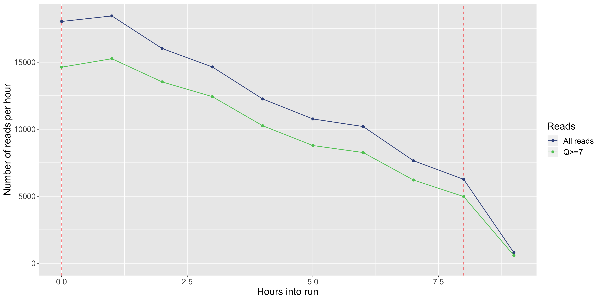

## 1. Summary

  Click [summary.yaml](./bgaud_nano/summary.yaml) to view

## 1. Gb Per Channel

## 2. Yield Over Time

## 3. Length Histogram

## 4. Quality Histogram

## 5. Reads Per Hour. png

**Questions**
+ Could we have stopped the run sooner, or should we have kept going?
+ What is the relationship between "quality" and "read length"?
+ What is the relationship between the rate of data collection and time?

# Other Things to Look At
These are less important, but still neat to examine!

## 6. Length Vs Quality

## 7. Quality by Hour

## 8. Yield by Length

## 9. Channel Summary

## 10. Flowcell Overview

## 11. Length By Hour

