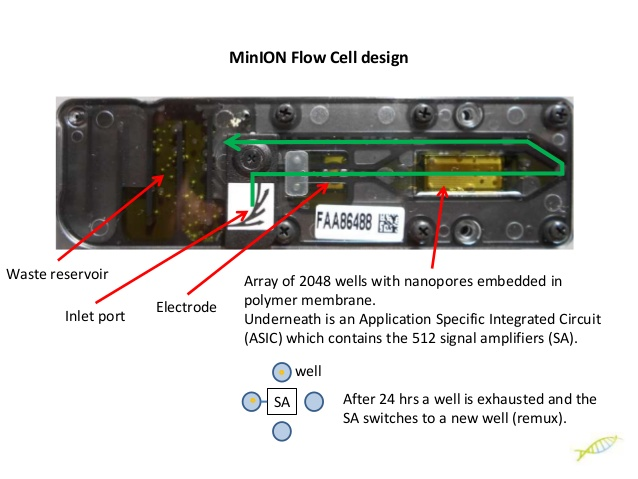
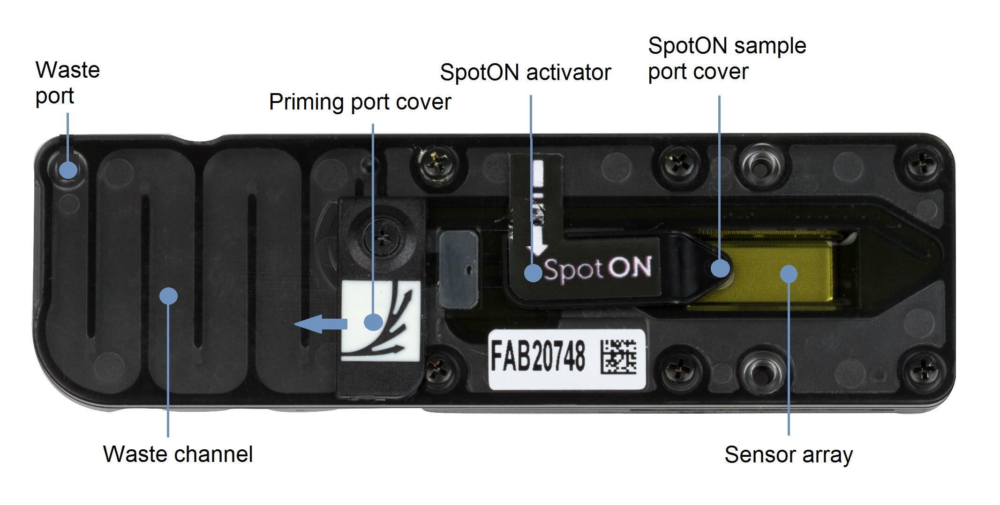

# NANOPORE DIRECT RNA SEQUENCING – LAB WORKFLOW SUMMARY

Unlike the Illumina sequencing platform for transcriptomics, the Nanopore Direct RNA sequencing approach does not require reversed transcription to synthesize complementary DNA (cDNA), and fragmentation. Long reads of full-transcripts can be obtained from the native RNA molecules in the sample. The main thing that can limit the length of your reads is poor sample handling that can unintentionally degrade or fragment the RNA.

Notice from the protocol, that we will be performing a reverse-transcription step. This is not required but recommended. The pores in the array will only read the RNA strand. By generating the first-strand of cDNA, we will be able to facilitate passage of the RNA strand through the pore, and to improve the accuracy and throughput of the reads.

Our lab workflow will follow these steps:
1. Brain RNA isolation & quantification of RNA
2. Reverse-transcription of the first-strand of cDNA
3. Adapters ligation
4. Two clean-up steps
5. Preparation of the RNA library for loading
6. Priming & loading the flow cell

## REVIEW OF REVERSE TRASCRIPTION
Simplified RT – Reverse Transcription Animation by Invitrogen (Life Technologies)

Visit http://www.lifetechnologies.com/superscript for more information. Learn how reverse transcription works in a fun animated video and how to select the right reverse transcriptases and primers for your experiment. Reverse transcription is a widely used technique in molecular biology where a RNA strand is reverse transcribed into its DNA ...

## PIPETTING SKILLS:
Good pipetting technique has a big impact on the quality of the results obtained from the Nanopore Direct RNA sequencing protocol. Please access the following video tutorials, to review the steps that you should follow for proper pipetting:

How to pipette correctly - a short step-by-step introduction into proper pipetting by Eppendorf:

Visit the Eppendorf Training Center: https://goo.gl/1l8XUF This three minute video improves your pipetting skills and secures a homogenous pipetting technique in your lab when all lab members follow these easy tips. Your assays will be more reproducible and reliable without depending on one person doing the experiment. We will show each ...

The Pipetting Cycle - Good Pipetting Technique by Mettler-Toledo

Pipetting with an air-displacement pipette is a five step process that is often referred to as "forward pipetting." In this short video, we demonstrate the five distinct steps of pipetting and how to do them correctly. Rainin pipettes: https://www.mt.com/global/en/home/pro...

## WHAT MAKES UP A MINION FLOW CELL?

## HOW TO LOAD A MINION FLOW CELL?

