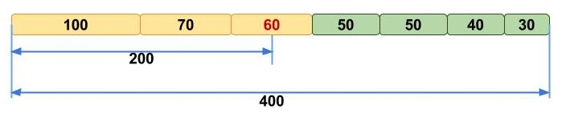

## Background Information (5-10 min)
What exactly is a <i> transcriptome </i> anyway?  Gene expression is a very dynamic process-- a transcriptome can be thought of as a "snapshot" of this process, or as a collection of all of the genes that are expressed in a particular tissue at a particular time.  An example might be brain during early development, or a skeletal muscle after exercise.  Our sequenced mRNA is a sample of the expressed genes.

Remember that technologies do not presently exist to sequence entire mRNA molecules, so we have to break them into small (presently ~300bp) sequences and sequence them in vast quantities.  This certainly allows us to generate huge amounts of data!  We ultimately hope to quantify the gene expression in or original sample.

This is pretty easy to do if you have a genome for your organism of interest-- you simply align the cleaned reads to the genome and voila,  the number of reads aligning to each gene sequence correspond to its expression level.  More on this later.

But what if you don't know what the genes look like?  Unfortunately, this is the case for many organisms that haven't had a genome sequenced yet.  We are left with the enormous problem of putting everything back together again (creating a "reference" transcriptome), before we can perform our quantification. This requires us to perform what is called a <i>de-novo</i> transcriptome assembly.

A  computationally efficient method of putting the transcriptome back together is also a method that appeals to common sense-- this is called the "DeBruin Graph" approach.  This method has several steps, but we will walk through the basic process:


1. Each read is broken down into overlapping strings of length "k"  (FYI, a k-mer is the name for a string of length k.)
2. An ordered list of kmers is generated (hash table)-- each k-mer overlaps by (k-1 bases)
3. Each <b>unique</b> kmer is assigned a node on a "graph"-- overlapping k-mers are adjacent to one-another.
4. Graphs are pruned; unbranched sets of nodes are compressed into larger nodes
5. Paths are traversed through graph to generate sequences (partially informed by known insert sizes)

Check out this video for a more detailed explanation: http://www.broadinstitute.org/partnerships/education/broade/trinity-screencast

## Memory Issues

This process, while logically straightforward is difficult to implement on the large scales of our transcriptome data.  Effectively, the computer has to keep track of every unique k-mer in the dataset in RAM.  This leads to fantastic amounts of RAM needed (hundreds of GB to terabytes) in order to perform the assembly.  It is relatively easy to gather a dataset that we don't have the computer power to assemble!

Fortunately, many smart people have been working to improve algorithms to make this process more efficient-- one of these is called "digital normalization", which acts to reduce the number of k-mers which need to be tracked by the assembler, reducing the memory footprint and increasing the speed with which the transcriptome can be assembled.    There are two sources of "superflous" k-mers:

1) *Redundant coverage of highly abundant genes* As the RNA-seq datasets represent a population of mRNAs, highly abundant genes are represented with more reads than lowly abundant genes.  But, these additional reads provide no more additional <i>information</i> about the sequence, only the amount of that sequence present in the data.

2) *Sequencing Errors*  Next generation sequences have about 1-2% error rates (1-2 bp in every 100bp is incorrect)-- the sequence reported is not the same as the actual sequence.  Because deBruin graphs keep track of every unique k-mer, many of the nodes in the de-bruin graph result from sequencing errors, and are therefore are not informative.  Because sequencing errors are random, the way to handle this is algorithmically simple-- the reads in a dataset are iterated through, and k-mers in each read are counted.  If the k-mers have been seen enough times previously (the number of times is a threshold set by user), the read is removed from the dataset.  If the k-mers have not been seen before, the read is retained.

This has two practical outcomes:  the most obvious is that "redundant" data from high-coverage genes is removed from the dataset.  The second outcome, is less intuitive, but important on memory usage.   Because of the 1-2% error rate, we  expect each read has an average of 1 sequencing error, which will introduce k number of erroneous k-mers.   Therefore, for every read that is removed, we remove k erroneous k-mers.  This apparently has minimal impact on the quality of the assembly (and in some cases, actually improves it!).  The interested can check out this paper by [Titus Brown](http://arxiv.org/pdf/1203.4802v2.pdf) to get more details.

## Running Trinity (~ 25 min)
Trinity is one of several software packages designed for de-novo RNA sequence assembly.  It is easy to use, but with that ease of use comes its own limitations-- for instance, you can't pick which size k-mers to use.  The practical consequences of are beyond this introductory course-- but see https://oyster-river-protocol.readthedocs.io/en/latest/ for a really nice, thorough exploration of this and many other issues regarding transcriptome assembly.

For now, the simplest method is a great place to start-- and if you get to the point where you need that fine degree of control, you'll have learned a lot!  We won't have time to construct a useful assembly, as they take many hours.  Instead, we'll examine the steps from a pre-calculated assembly based on the data that you performed QC on.

Some caveats about Trinity:

1.  It is a total memory pig.  You need a lot of memory and a lot of time on the cluster to make this work.  Odds are your first submissions will fail.  Don't get frustrated, the pig can be tamed!
2. Trinity can be restarted!  Yay!  If you get to a point in the process where Trinity suddenly dies, don't delete your work!  You can restart Trinity and it starts more or less where it left off.


### How to Run Trinity
Trinity has a lot of options, here's the "submission script":

```bash
#trinity_run.sb
#!/bin/bash --login
########## Define Resources Needed with SBATCH Lines ##########

#SBATCH --time=08:00:00             # limit of wall clock time - how long the job will run (same as -t)
#SBATCH --ntasks=1                  # number of tasks - how many tasks (nodes) that you require (same as -n)
#SBATCH --cpus-per-task=30           # number of CPUs (or cores) per task (same as -c)
#SBATCH --mem=160G                  # memory required per node - amount of memory (in bytes)
#SBATCH --job-name trinity_run     # you can give your job a name for easier identification (same as -J)

########## Command Lines to Run ##########
cd ${SLURM_SUBMIT_DIR}
module load Trinity/2.8.4
Trinity.pl --seqType fq --max_memory 150G --left 74_brain_S26_L002_R1_001.fastq.gz --right 74_brain_S26_L002_R2_001.fastq.gz --CPU 25 --trimmomatic
```

+ `--SeqType` specifies the type of input file (in our case Fastq).
+ `--max_memory` specifies the amount of RAM to use, selected proportional to the amount of reads, and has to be determined somewhat empirically.  Good to set high to ensure everything stays running!)  Also note that this should be slightly less than the total memory requested for the job, as Trinity runs programs in the background to monitor the status of things.
+ `--left` and `--right` specify the R1 files and R2 files from the sequencer.  Note the `--trimmomatic` flag which automagically applies MacManes' recommended filters by default!
+ `--output` specifies the name of the directory
+ `--CPU` specfies the number of CPUs that can be utilized to run calculations in parallel can use.  Pick this carefully, too many and the job won't run!

Here are the runtime statistics for our job:

```
Runtime
=======
Number of reads: 23437550
Output data: Trinity.fasta 219 MByte
Trinity   24136 seconds (~7h)
  Inchworm (phase 1 - read clustering)  3161 seconds (< 1h)
  Chrysalis (phase 1 - read clustering) 19142 seconds (5.3 h)
  Rest (phase 2 - parallel assembly)       1833 seconds (30 min)
```

Notice that the submission script for `Trinity` is written in a very strange seeming language that we haven't seen before: this is called [SLURM](https://slurm.schedmd.com), and is reserved for computationally intensive tasks.  Imagine you all ran this job at once, but there was only 50 CPUs up for grabs.  How would this work?  Now imagine hundreds or even thousands of people.  In order to ensure resources are used fairly, a rule system is enforced by the HPCC manager.  This sets up a queue to run jobs.  It's far from "first come first served", but integrates the length of the job you need to run, how often you use the cluster, how many resources you need, and prioritizes your job for the next available slot using algorithms.  During "high use" or when you need resource intensive jobs, your job may wait for days to run.  Most often, it will run fairly soon (minutes to hours after submission).   For a quick "peek" at the queue, type:

```bash
squeue
```

Impressive, eh?

### Examining and Evaluating Trinity output
(ideas from: https://github.com/griffithlab/rnaseq_tutorial/wiki/Trinity-Assembly-And-Analysis)

Let's take a look at the fruits of our labor by just peeking at the top of the Transcriptome assembly using the following command:

```bash
head bgaud_74_brain.trinity.fasta
```

```
>TRINITY_DN8_c0_g1_i1 len=714 path=[0:0-713]
CCAGCGTGTTGGTGCAGTCGAAGTCGCACACGTTCCGCTCACACTCGTCCACGTCTAGCAAACACACGCGCGCGGACGAGGTCTTGGGTCACCACAGGCAGGGATGAAGACGGGAGCTCCAGCCCAAATGAATGACGTGCCTGAGACGTCTTGAGCTTGTTATTTGTGTGATGTTTGAGGTGATATTTGTAATACTGAAACTACCAAAAGGCCAGATAATACATGGTAAATTCAGCGTCTGGGGCGTTTACGCAGGGTTAACTGGTTTATAACGCCCTCTAGTGGTAACTGGACTGCATGTCCATAGAGGTGACTGTCAGTGGTCTGTAGCAAATATGCCAGTGCTGATGGGCACAGTGAATTGGACAGAGTTCAAGTGACACTAATGGTGGGAGGAACTCTGGGAACCTAGACTGGAGTTCTGGGTGGCTTCAGCTTTGCACTGGAAGGCTGCAGCTCCCTTTTCCAAAAGAACAGAAGAGACACGGGACGAACAGAGACGATAAAGAGGACAGAGAGAAGCAGAGACAATAGGGAGGACAGGGAGCTGTGGAGCATGAAAACTTTGCCCCAAGAAACCACAGGGGAATTCAGAGGGTAAGGAGGGGAGGACTTTCATCCAAAATTCAGCCGTTACATAACAGTGTGTTGTTCGTGTGTTTGTGTGTGTGTGTGTGTTCTCTTACCCTGGCACTCGCGGGAGGTGAAGTTATA
>TRINITY_DN8_c0_g2_i1 len=869 path=[0:0-247 2:248-868]
````
There is a lot of information here!  You should be pleased to see assembled transcripts at this point.  This is a FASTA formatted file a way of storing sequence data in plain text.  The first line is the "header" line demarked by the `>` character.  Following this is the transcript name.  This has a fairly rigid format:

+ In the example above, the accession 'TRINITY_DN1000|c115_g5_i1' indicates Trinity read cluster 'TRINITY_DN8_c0', gene 'g1', and isoform 'i1'. Because a given run of trinity involves many many clusters of reads, each of which are assembled separately, and because the 'gene' numberings are unique within a given processed read cluster, the 'gene' identifier should be considered an aggregate of the read cluster and corresponding gene identifier, which in this case would be 'TRINITY_DN8_g1'.

+ The Path information stored in the header (">TRINITY_DN8_c0_g2_i1 len=869 path=[0:0-247 2:248-868]") indicates the path traversed in the Trinity compacted de Bruijn graph to construct that transcript. In this case, node '0' corresponds to sequence range 0-247 of the transcript, and node '2' corresponds to sequence range 248-868 of the transcript. The node numbers are unique only in the context of a given Trinity gene identifier, and so graph nodes can be compared among isoforms to identify unique and shared sequences of each isoform of a given gene.

#### Assembly metrics
We can obtain basic assembly statistics using a utility built into Trinity by running the following (may take a few seconds-minutes to run):

```bash
module load Trinity/2.8.4
TrinityStats.pl bgaud_74_brain.trinity.fasta
```

Which tells us a lot of additional information:

```
################################
## Counts of transcripts, etc.
################################
Total trinity 'genes':	112282
Total trinity transcripts:	173984
Percent GC: 48.13

########################################
Stats based on ALL transcript contigs:
########################################

	Contig N10: 6587
	Contig N20: 4916
	Contig N30: 3999
	Contig N40: 3246
	Contig N50: 2624

	Median contig length: 543
	Average contig: 1245.04
	Total assembled bases: 216617791


#####################################################
## Stats based on ONLY LONGEST ISOFORM per 'GENE':
#####################################################

	Contig N10: 5768
	Contig N20: 4240
	Contig N30: 3246
	Contig N40: 2452
	Contig N50: 1749

	Median contig length: 392
	Average contig: 840.78
	Total assembled bases: 94404953
```
Questions:
+ How many genes have been assembled?
+ How many alternative splice variants?
+ What is the 'Contig N50'?
+ What does 'Contig N50' mean?
+ Why would this be important?

#### What's an N50?
(from: https://www.molecularecologist.com/2017/03/whats-n50/)
Many people struggle initially to grasp the concept of N50, but we like to picture it like this. Imagine that you line up all the contigs in your assembly in the order of their sequence lengths (Fig. 1a). You have the longest contig first, then the second longest, and so on with the shortest ones in the end. Then you start adding up the lengths of all contigs from the beginning, so you take the longest contig + the second longest + the third longest and so on — all the way until you’ve reached the number that is making up 50% of your total assembly length. That length of the contig that you stopped counting at, this will be your N50 number (Fig. 1b).



+ The total number of 'genes' is the number of unique transcript identifier prefixes (without the `_i` isoform numbers).
+ You'll also see 'Contig N50' values reported. How useful is N50 in reality for assessing transcriptome quality?
+ RNA-Seq assembly can be easily biased by the assembler generating many non-independent isoforms for the same 'gene', artificially inflating N50.  
+ If coverage is high, sequencing errors and 'noise', and possibly 'incomplete' transcripts (transcripts in the process of being 'made' when RNA is sequenced could bias N50 downward.

#### BLAST: Identifying Transcripts

Currently, our transcripts are just sequences-- how do we figure out what sequence is what?  This process is called *annotation*.  There are many ways to generate annotations-- a common way is to use sequence homology with a well-annotated/model organism to identify the sequence.  To get an overview of this process, let's try doing a BLAST search of a particular gene:

1.  Visit https://blast.ncbi.nlm.nih.gov/Blast.cgi
2. Choose "blastx"
3. Paste this sequence into the query text area:
```
>augustus_masked-258-processed-gene-16.2-mRNA-1
ATGGAAGAAATCTTCAAGGATCAGGACCTTTTGTCTTTCAATGATTCATGGAAAAATTCT
ACTTTTGGGAACGAAACTGACGGCGTAAACCAAACAGTGAACCCCCTAAAACGGAATGAA
GAGGTAGCAAAGGTGGAGGTTACGGTATTGGCTTTAATCTTGCTTTTTGCGCTCGCCGGC
AACATATGTGTCCTGGTTGCTATCCATACAGGCAAACACAGTCAATCTCGCATGTATTAC
TTCATGAAGCACCTCAGCATTGCGGACCTGGTGGTGGCAATCTTTCAGGTCCTACCTCAA
CTCATTTGGGACATTACTTTTCGCTTCTATGGACCAGACATCCTCTGCAGGTTGGTGAAA
TACCTTCAAATAGTCGGAATGTTTGCCTCCACCTACATGCTTGTACTGATGTCCATAGAC
AGGTGCTTGGCTATCTGCCAGCCACTACGCTCTTTGCATAAACGAAAGGACCGGTTTTAC
GTTATTTTCTCCTGGGTCCTCAGCTTGCTTTTCAGTGTCCCACAAGTTTACATCTTTCAA
CTGAGAGAAGTTGGATCCGGAGTATATGACTGTTGGGGAGACTTTGTACAGCCTTGGGGG
GCCAAGGCATACATCACTTGGATAAGCCTCACCATCTACATTATTCCAGTTACAATACTA
AGCATTTGCTACGGACTAATAAGTTTTAAAATATGGCAGAACTTTAAGCTGAAAACTAAG
CGAGACCAGTGCATGACGCTGACACCAACCGCGTGGAAAAGCAGCGCGCTGGCGCGCGTC
AGCAGCGTCAGACTCATCTCCAAGGCCAAGATCACCACCGTTAAAATGACGTTTGTCATC
GTCCTGGCCTATGTCGTGTGCTGGACCCCGTTCTTCTTCGTACAGATGTGGTCGGCTTGG
GACCCTGCAGCGCCCAGGGAAGGTAAGTTCAGTGTGTGA
```
4. Enter 'Danio rerio' into the organism box
5. Click BLAST

**Questions**
1. What gene is this the sequence for?
2. Are you sure??

#### Evaluate Full Length Transcripts

Getting back to our task at hand-- There's another way to assess the 'completeness' of a transcriptome assembly: by evaluating the number of transcripts that code for a full protein.  We can do this by comparing the contents of our newly assembled transcriptome to a reference species.  Since we don't have a great reference (at the moment...) for *B. gauderio*, we'll compare it to the NCBI reference set of proteins from the zebrafish, *Danio rerio*.

Performing this search using "graphical" blast would require you to copy and paste each of the 173,984 transcripts in and waiting.  This is obviously a time consuming step, so I've pre-generated this data for you to keep things moving.  Let's look at the code for how this works together:

The data is sourced from this website, let's have a look:
[https://www.ncbi.nlm.nih.gov/genome?term=danio%20rerio](https://www.ncbi.nlm.nih.gov/genome?term=danio%20rerio)

```bash
#DON'T run this code, just look!
wget ftp://ftp.ncbi.nlm.nih.gov/genomes/all/GCF/000/002/035/GCF_000002035.6_GRCz11/GCF_000002035.6_GRCz11_protein.faa.gz
gunzip GCF_000002035.6_GRCz11_protein.faa.gz
mv GCF_000002035.6_GRCz11_protein.faa danio_protein.fa
makeblastdb -in danio_protein.fa -parse_seqids -dbtype prot
module load MAKER
fasta_tool --chunks 200 bgaud_74_brain.trinity.fasta
mkdir bgaud_split
mv bgaud_74_brain.trinity_* bgaud_split/
sbatch submit_blast_x.sb
cat bgaud_blastp_results/*.blastx > ./bgaud_blastp.blastx
sed '/^>/ s/|.*//' danio_protein.fa > danio_protein.mod2.fa
```

```bash
## submit_blast_x.sb
#!/bin/bash --login
########## Define Resources Needed with SBATCH Lines ##########

#SBATCH --time=02:00:00             # limit of wall clock time - how long the job will run (same as -t)
#SBATCH --ntasks=1                  # number of tasks - how many tasks (nodes) that you require (same as -n)
#SBATCH --cpus-per-task=5           # number of CPUs (or cores) per task (same as -c)
#SBATCH --mem=4G                    # memory required per node - amount of memory (in bytes)
#SBATCH --job-name blastx_danio_bgaud      # you can give your job a name for easier identification (same as -J)
#SBATCH --array=0-203

########## Command Lines to Run ##########

module load BLAST+

cd ${SLURM_SUBMIT_DIR}

export BLASTDB=/mnt/gs18/scratch/users/jgallant/nbcs_rnaseq
export   NCBI_CONFIG__BLAST__LONG_SEQID=1
### change to the working directory where your code is located

filenum=(`seq -w 000 203`)

### call your executable
blastx -db danio_protein.fa -query ./bgaud_split/bgaud_74_brain.trinity_${filenum[${SLURM_ARRAY_TASK_ID}]}.fasta -out ./bgaud_blastp_results/bgaud_74_brain_${filenum[${SLURM_ARRAY_TASK_ID}]}.blastx -evalue .000001 -outfmt 6 -num_alignments 1 -soft_masking true -lcase_masking -max_hsps 1
```
**Questions**
+ What is this code chunk doing?
+ What is the command `--array=0-203` doing?
+ What does the variable `${SLURM_ARRAY_TASK_ID}` represent?

### Parallelism
This example motivates an essential principle of high performance computing systems-- parallelism.  Our newly assembled transcriptome contains 173,984 transcripts.  If we were to sequentially BLAST search these against a database, it would take a long time (t).  This type of problem (where the tasks are not interdependent) is called an *embarassingly parallel* problem, where the tasks could be subdivided into chunks (N).  The speedup is therefore (t/N)


In the first script, we take the query sequences (our transcriptome) and split it into 200 chunks-- so now BLAST only has to operate on 870 sequences at a time.

### Analyze BLAST Results:

Now that we've discussed how we obtain the data, time to do the analysis.  Our BLAST results are mashed back together into `bgaud_blastp.blastx`, we also need to supply the original FASTA file for the danio proteins, and give the report a name for looking at later:

```bash
module load Trinity/2.8.4
analyze_blastPlus_topHit_coverage.pl ./bgaud_blastp.blastx bgaud_74_brain.trinity.fasta danio_protein.mod2.fa bgaud74_cov_report
cat bgaud74_cov_report.hist | column -t
```

Here's what the results look like:
```
#hit_pct_cov_bin  count_in_bin  >bin_below
100               11759         11759
90                1376          13135
80                1183          14318
70                1290          15608
60                1455          17063
50                1528          18591
40                1562          20153
30                1836          21989
20                2120          24109
10                1734          25843
```
**Questions**
+ How did we do?  Is it a good assembly, or not really?  Use the data to interpret.
+ How might the assembly be improved based on what you know?

## Module 2 Review:
In this module, we learned:
+ What a transcriptome is, and how they are assembled
+ Considerations for running your own assembly, and how to use Trinity to perform an Assembly
+ How to evaluate a new assembly's quality using N50 and how many sequences encode "full length" proteins.
